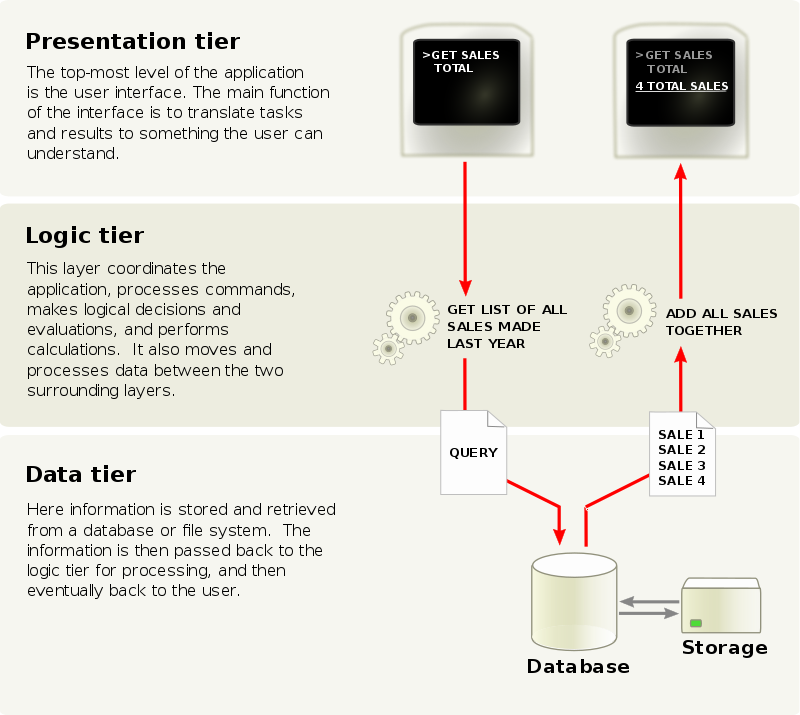

# Characteristic of Application Programs

- Diversity: These applications widely differ in their domain, functionality, user base, response time, scale, daily hit and many more
- Applications are functionally split into frontend layer, middle layer, backend layer

## Frontend or Presentation Layer / Tier 
- Interacts with the user: Display / View, Input / Output 
- Choose item, Add to cart, Checkout, Pay, Track order 
- Interfaces may be, Browser-based, Mobile App, or Custom

## Middle or Application / Business Logic Layer / Tier 
- Implements the Functionality of the Application: Links front and backend 
- Authentication, Search / Browse logic, Pricing, Cart management, Payment handling (gateway), Order management (mail / SMS / internal actions), Delivery management
- Support functionality based on frontend interface

## Backend or Data Access Layer / Tier 
- Manages persistent data, large volume, efficient access, security
- User, Cart, Inventory, Order, Vendor databases

(Source: Multitier Archtecture - Wikipedia)

### Application Architectures: Layers
- Presentation Layer/Tier
  - Model-View-Controller (MVC) architecture 
    - **model**: business logic 
    - **view**: presentation of data, depends on display device
    - **controller**: receives events, executes actions, and returns a view to the user

- Business Logic Layer/Tier 
  - provides high level view of data and actions on data 
    - often using an object data model 
  - hides details of data storage schema

- Data Access Layer/Tier 
  - interfaces between business logic layer and the underlying database 
  - provides mapping from object model of business layer to relational model of database
